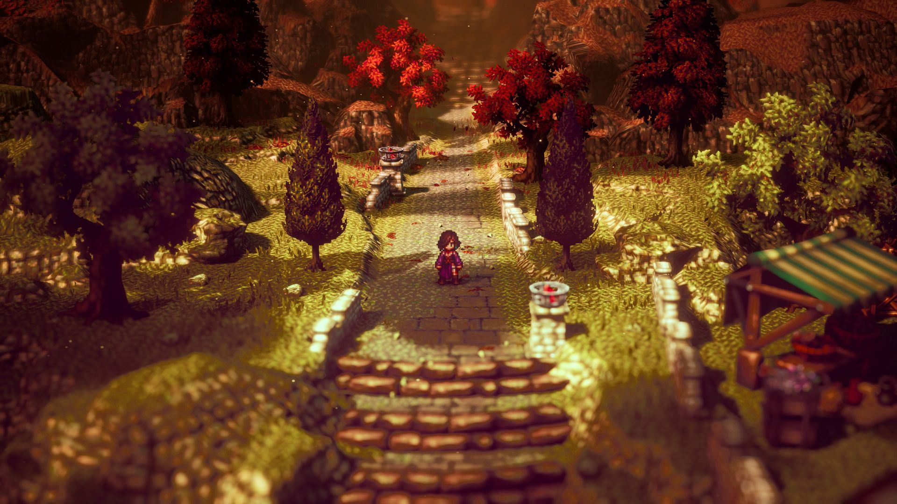

# Quiz 8 
**Here are two inspiring artworks for my assignment. First is the painting called Celebration from LARRIEU Jean-François. The second artwork that inspires me is a game called Octopath Traveller. They mainly inspire me by showing that we can create complex images using many basic shapes. In the painting, fireworks are composed of many different colored lines. And Octopath Traveller is a pixel art game, which creates beautiful visuals using countless pixel blocks. At the same time, we can add interactive elements, such as interacting with characters and scenes.**

We can use Python and Pygame to creat the similar scene of Celebration and Octopath Traveller. Use Pygame's drawing functions to create the elements of the celebration, such as balloons, confetti, and text, and use FOR loop to draw pixel blocks for the scene. Then we can use key press function to make the interactive effects with characters or elements.
